# 自制省钱高性价比maimaiDX控制器$全!$解

## 第零部分 协议

### 对于请勿侵犯SEGA以及WAHLAP权益的声明
本作仅适用于个人制作游玩，原则上不提倡也不反对制作后发售。若发售或由读者自己的行为造成不当影响和任何纠纷，本教程作者和本教程不负任何责任。请勿侵犯SEGA以及WAHLAP权益。若作者行为或是本教程产生了不良影响，我对我的行为表示抱歉并可修补甚至撤下本教程，希望大家的理解。  
当大家在展示自己手台效果的时候，不要发布不该发布的东西，让我们一起遵守。

### 对于协力者，贡献者的感谢

我的触摸代码部分几乎完全是mai2touch的项目搬来的，然后更改修复了一些mpr121配置上的问题，配置部分借鉴了Arduino-Chunithm-Controller的代码。读卡器使用的也是同作者的Arduino-Aime-Reader。在此对mai2touch，Arduino-Chunithm-Controller,Arduino-Aime-Reader和它们的作者表示衷心的感谢，如果没有mai2touch和Arduino-Chunithm-Controller以及对它们下了很多心血的作者，我的控制器将失去它最重要的灵魂。  
在此感谢[Sucareto](https://github.com/Sucareto)以及他的项目[Arduino-Aime-Reader](https://github.com/Sucareto/Arduino-Aime-Reader)，[Arduino-Chunithm-Controller](https://github.com/Sucareto/Arduino-Chunithm-Controller)和[mai2Touch](https://github.com/Sucareto/Mai2Touch)!

传承开源精神，我将自用的程序开源，但是仅仅用于我手里的硬件测试成功，不同的走线，制作方法，使用的mpr配置等也不一样，不建议照搬。

### 对于本教程版权的声明

本教程是由Helloworld_Dk纯手打写出的，思路也是几乎完全自己想的。  
如果我能给大家的想法产生帮助，我感到非常荣幸，如果您觉得我的方案对您有帮助，希望可以在您的项目发布时，跟上一句"本方案的部分灵感来自Dk"或类似的话，我将不甚感激

## 第一部分 总览

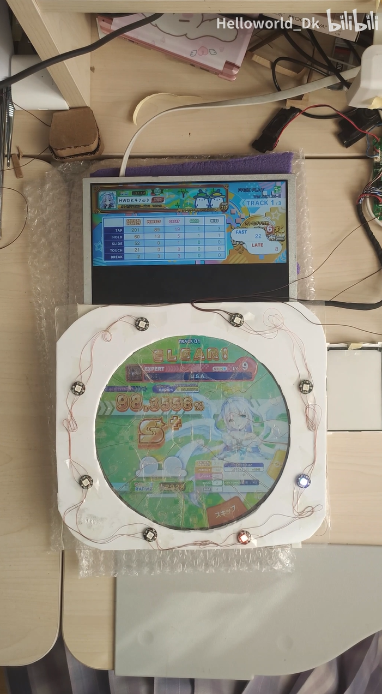

本方案是使用导电膜裁切，漆包线引出的触摸部分为核心的低价maimai控制器制作方案。由于被~~逼到无奈~~很多也像制作maimai手台的玩家支持，而写了这样的一个教程。

本作品旨在弄个便宜好用的方案，让大多数人都可以轻松把这个东西做出来，同时不要效果差到没法玩。

为想要做一个maimai手台，而又对高昂的价格和空缺的思路望而却步的观众们提供一个全新的高性价比的思路。

只要你不嫌麻烦，有耐心，有学习的精神，就可以以非常低的价格做出视频中的样子。甚至，可以使用这个思路做一个超低价的街机尺寸台

所以没有想过类似定制玻璃什么的，当然，使用定制的材料一定会让效果更好，甚至还原出街机的水准。

被骂哭了，视频删掉了。  
我错了，请不要再骂我或者嘲讽我了。  
以下两个链接无效：

```
### [方案效果展示](https://www.bilibili.com/video/BV1pe4y1m7pr/)
### [使用32u4的延迟更新后的展示](https://www.bilibili.com/video/BV1PW4y1E7io/)
```
<h2>todo: 另一个项目，顺利的话，大的要来了|来了，是读卡器那个项目，请进入我的主页打开读卡器项目！</h2>

## 常见问题
1.本教程内程序似乎无法在43寸设备上正常运行，但不意味着本项目无法做43寸版本。需要调整mpr121参数才可以在43寸设备上使用，具体参数请自行尝试，后续我会公开43寸参数。   现在已在43寸上测试成功可用，程序已发。  
### 本项目有14寸，15寸，43寸已有人制作成功，如果你没有成功，请不要急着喷项目，因为大有可能是你制作上的问题，以下是别的同志在制作过程 ~~自以为是~~ 中遇到的问题，我让其改正后均可解决。问题存在性和致命性均经过事实验证，不保证这样做一定会失败，也不保证不这样做一定会成功，但这样做大概率会失败。同时如果你想要找我指导或者提出issue，请确保你没有犯下述内容中的错误，否则拉黑不予处理。
```
1.自以为是，擅自不按照教程执行，还觉得自己很对，觉得这样不影响。如果您对mpr之类的原理不熟悉，比如不知道他是个电容触摸传感器，没有注意，然后将触摸板或模块置于金属桌子或腿上测试失败者。还有不知道电容类传感器电极相关注意事项而使用自己的错误方法连接模块和电极等。  （解决：不熟悉的按照教程来，完全复刻，不容易出问题，您认为的影响不大，可能影响很大。）    
2.使用杜邦线连接各设备，或者直接将线拧在一起来连接，将线芯跟mpr焊盘绑起来连接，如果杜邦线，连接方式不牢靠，松动，劣质，氧化严重，可能导致触摸板电极或mpr无故停止工作，数据异常。（原因：瞬间的电容值变化容易让mpr的自动适应算法无法处理，会导致mpr内部出错。而mpr数据线松动，可能导致mpr数据传输错误，或断点重启而未初始化。同时，公头杜邦线那根金属针如果直接接触电极，由于杜邦线自带塑料会让其倾斜，实际上连接会非常不稳定，只有一个似断非断的点状导电面接触脆弱的导电涂层，导致电气性能极差等）（解决：作者建议能焊接的线不要怕麻烦，全部进行焊接，实际上掌握了焊接，熟练的时候焊接比插线快。mpr引脚连接电极，mpr端焊接，另一端剥长皮打圈）  
3.电极导线触及屏幕，屏幕内走线等有可能导电，相当于手去触摸，导致电极一直处于按下状态，mpr无法识别到底手按还是没按（解决方法：走线固定好，与电极一同距离屏幕有一段距离）  
4.电极导线长度差距巨大，长的导线可能造成更大的电容值，短的导线电容值小，导致mpr电极间读数呈现一些高一些低，灵敏度设置极其复杂难以实现。（解决方法：尽量规整走线，用多长截多长，并让线间距离相等，不要过远过近，其次以较短的路径连接到mpr，可以让导线间差距缩到比较小）  
5.将mpr所有引进包括电极插到面包板再插杜邦线引出，杜邦线说过不再提，面包板内部是许多条金属片，金属片具有一定面积，会让电极间产生不必要的电容，轻则影响读数，重则无法读数。（解决方法：建议用焊接线的方法，连接所有电路，并将整个电路固定在一张不导电的板上，等效于电路悬空不受干扰。而不使用其他连接方式）  
6.尝试使用5v单片机，mpr电源/IO电压是2.5-3.6v，低则可能无法工作，高则可能直接烧坏mpr。目前大家能买到的mpr模块（上面仅由mpr，几个电容电阻组成）不带电压转换芯片，无法在5v下正常工作。目前没见到使用简易mpr板子配合5v单片机能正常工作的。（解决方法：使用3.3v单片机，或使用adafruit出品的mpr之类，自带电平转换，支持3.3-5v宽电压的版本。实际一片带电平转换的版本跟简易mpr的差价就超过了5v单片机跟3.3v的差价，所以还是买3.3v单片机合适）（下有常见单片机电压）   
7.不会写程序，乱改程序还觉得自己很对，自己反省。(解决方案：小台直接使用sucareto开源的版本或者我开源的版本，大台自己学一学再整或者等我发大台参数)   
8.找我问问题，指导或提issue，而不把自己改了什么东西告诉我，不按照教程做但隐瞒，我让你怎么处理你不按我要求处理，我让刷我测试程序告诉我数据你非要把程序改了再发我数据，让打狗却去逮鸡，还表现的得意洋洋，觉得自己很对，这种人再出现在我面前我直接拉黑。
9.切割导电膜误差大，两片触控区间缝隙小，可能会造成串区和数据异常。（解决方案：按照教程一步步来，打印对照纸来辅助裁切，切得缝隙间距不要一窄一宽。如果是大台一张a4打印不完，可以分多张打印，总之，尽量裁切准确，贴准确，让缝隙大小均等，避免问题）
```


| 常见品类 | 单片机常见支持电压 | 说明      |
|---------|------------------|-----------|
| ESP系列 |       3.3v    |  esp系列一般都是3.3v，一般可以直接连接mpr|
| 328p,168p| 1.8v-5v,常见为3.3v| 代表产品：Arduino UNO/NANO/MINI 一般可以直接连接mpr|
| 32u4    |   具体多少不知道，常见为3.3v和5v| 代表产品：Leonardo，pro micro。其大部分未说明的都是5v，少数有说明是3.3v的，才是3.3v版本，5v不可以连接mpr，3.3v可以。|

第二行uno/nano/mini我近期发现还是有很多5v的，一定做好分辨，否则买回来不能用就傻了

~~tips：esp,328p,168p大部分需要连接usb串口才能造出usb串口，延迟较大，本人推荐32u4这种自带usb的有低延迟usb串口的芯片。3.3vpromicro一般很贵且只有8Mhz晶振版本。作者在某橙色购物软件上找到一款，typec的有粉色黑色沉金pcb自带复位键还引出iic的版本16Mhz，只要30，具体店铺就不放了，本人试过非常好用，性价比很高，可以搜搜看~~ 

stat: 延迟的问题已经被消除，写一个常见问题解答（重要！！，包含非常普遍和致命（？）或麻烦的错误）已完成

## 43寸版本 制作测试成功！！！！！43寸可用代码（参数）已经上传！！！  
**43寸版本 73行 cap.writeRegister(MPR121_ECR, B10000000 + 12);//MprRun 改成B01000000 + 12可能有优化的效果！感谢yywooc的优化**  
目前14，15，43寸都已被测试成功可用

## 第二部分 目录
- 第零部分 协议
    - 对于请勿侵犯SEGA以及WAHLAP权益的声明
    - 对于协力者，贡献者的感谢
    - 对于本教程版权的声明
- 第一部分 总览
    - 介绍
    - 方案效果展示
    - todo和stat
- 第二部分 目录
    - 目录
- 第三部分 触屏制作指导
- 第四部分 读卡器个人思路分享
- 第五部分 已删除
- 第六部分 按键和灯光（未完成）
## 第三部分 触屏制作指导
**这位更是重量级**

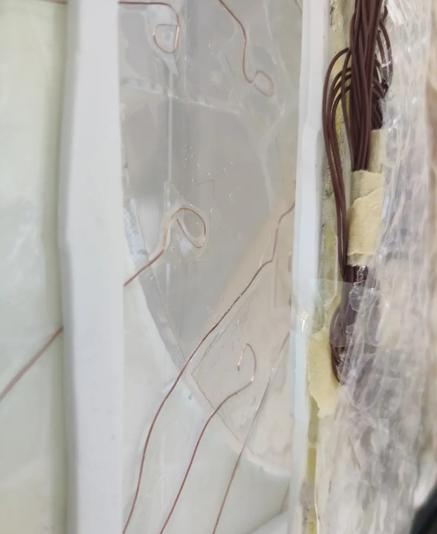

整个制作是非常的省钱，非常的好用，像是铝箔贴的chuni控制器，纯手作省钱能用就行精神是这样的。

被骂哭了，专栏一并删掉了。  
我错了，请不要再骂我或者嘲讽我了。  
以下一个链接无效：
本教程与之前发布的[专栏](https://www.bilibili.com/read/cv19157015)相互照应，相互补充，建议一起阅读

```圣经
做 手 台 不 试 试 瞎 搞 手 作 便 宜 省 钱 ， 就 像 四 大 名 著 不 看 红 楼 梦 ， 说 明 这 个 人 文 学 造 诣 和 自 我 修 养 不 足 ， 他 理 解 不 了 这 种 内 在 的 阳 春 白 雪 的 高 雅 艺 术 ， 他 只 能 看 到 外 表 的 辞 藻 堆 砌 ， 参 不 透 其 中 深 奥 的 精 神 内 核 ， 他 整 个 人 的 层 次 就 卡 在 这 里 了 ， 只 能 度 过 一 个 相 对 失 败 的 人 生。
```

**你需要的材料：**  
- 触摸部分
  - 尺寸合适的ito导电膜，一定要买带胶，除非你真的想好了胶怎么办。下面会有为什么要这么做的说明。
  - 一张较薄的亚克力板或者玻璃板，尺寸至少覆盖圆形屏幕区域。此处感觉玻璃容易碎，亚克力容易划花，大家自行斟酌。本人使用的一张比亚克力优秀的塑料板。
  -  较细的漆包线
  -  你超棒的手工能力
  -  透明胶带
- 屏幕部分
  -  一块跟你触摸板相对应的合适大小的屏幕，本教程应该不适用于小于十寸的屏幕。
- 程序和mcu
  -  本人使用的mai2touch项目，并对其进行修改，相关链接在教程开头协议部分。
  - Arduino或类似的开发板，我建议使用pro micro，不建议使用使用了ch340串口ic的板子。但是我使用pro micro被喷过和嘲讽过.....别人说它性能太差，可是我真的喜欢。
  
  **mpr最大支持电压是3.6v，使用5v io/vcc 的单片机十有九.八会造成mpr不可用，请使用3.3v io/vcc的单片机。大多Leonardo，promicro都是5v的，少数3.3v才是我们需要的，请不要买错否则白买。**


**制作过程详解**  
这部分在专栏讲的很详细，特别是图片详细。  
统共有以下步骤：  
### 1\. 打印对照纸
说的玄乎，其实就是用一张A4纸或类似的纸，将触摸区块图片打印下来。尺寸要与你目标屏幕显示的大小完全对应。建议打印至少两张。

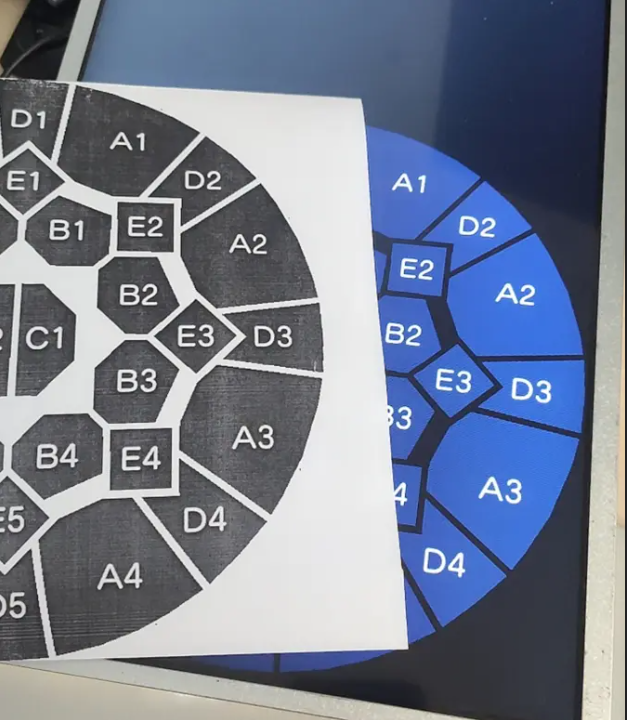

### 2\. 裁切
把a4纸跟买到的触摸膜贴在一起固定好，然后根据a4纸，裁下每一片触摸区块  
注意一定要固定好哦，不然剪着剪着位移了剪除奇形怪状的区块可就难办了！
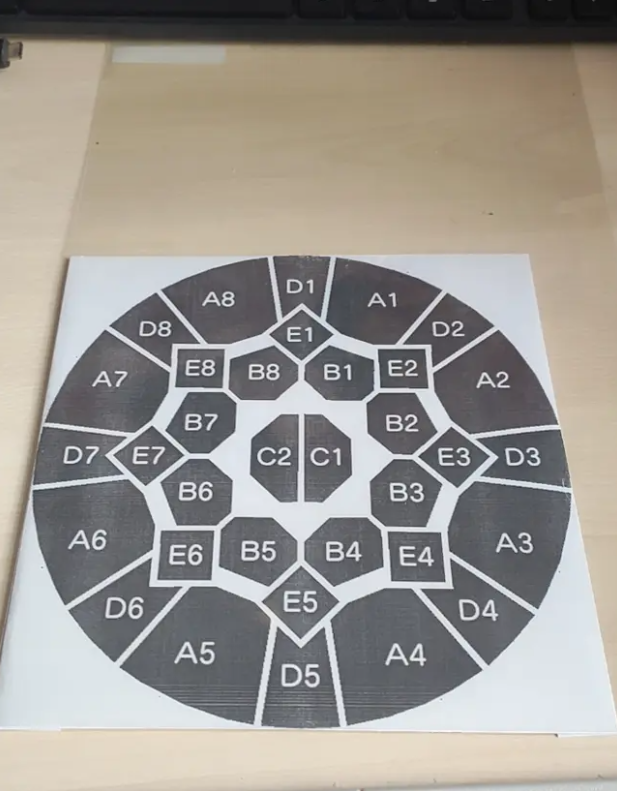
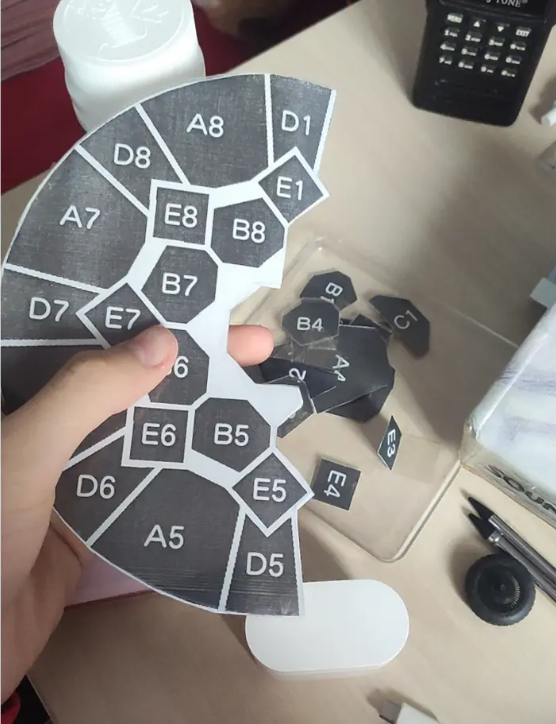
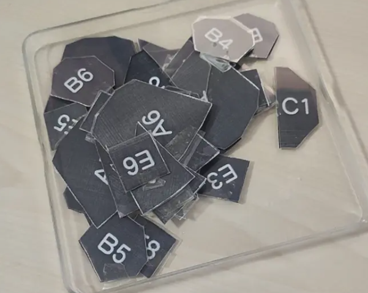
## 3\.粘贴

首先你不是打印了两张A4纸吗，一张被剪了，另一张好好的，请规划好位置之后，把A4纸打印面朝向亚克力板或玻璃板粘贴，在另一面应该可以透过亚克力板或者玻璃板，看到另一面清晰的打印的区块。用于之后粘贴位置的对应。
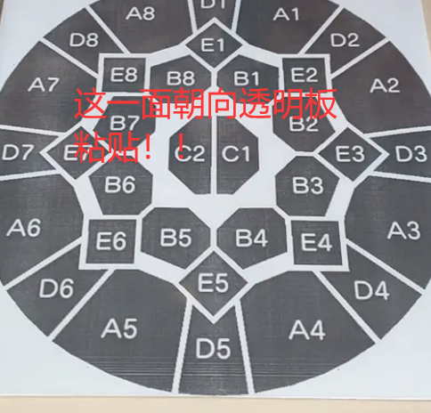

导电膜是这样的结构：  
不导电面朝上，导电面朝下，依次是： 

0. 一层保护膜
1. （如果是带胶的才有）一层透明胶
2. 聚酯离型膜，自此间隔，上面称为不导电面，下面称为导电面，不导电面有胶，导电面无胶
3. ito导电涂层
4. 一层保护膜

在**粘贴**这一步，我们需要完成的是

0. 亚克力或玻璃板
1. （如果是带胶的自带，没带胶的会让你痛苦到怀疑人生）一层透明胶
2. 聚酯离型膜
3. ito导电涂层
4. 一层保护膜

假设没有买带胶的膜，就自行点胶（透明的，支持粘贴塑料的，不会腐蚀塑料的，固化不回缩的，粘贴可以调整的）固定每片触摸块到屏幕上。  
在写这篇教程的时候，我自己搞的胶腐蚀了我的塑料板，导致A5区域透明性下降...**距今已过去十分钟，警钟敲烂**，所以千万别贪便宜买不带胶的！  
需要撕下不导电面的保护膜。不导电面朝向塑料板粘贴，**请勿将导电面贴到塑料板上**。  
如果是买的带胶的导电膜，不导电面恰好是带胶面，裁好了可以轻松粘在塑料板上。完全不用经历大力对抗胶水的那一步。  
~~唉，这个地方别省钱，要不让你感受人间痛苦，宛如晚清十大酷刑。~~

~~自己搞胶的痛苦，详见专栏图片。~~

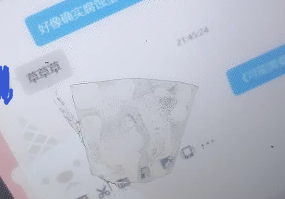
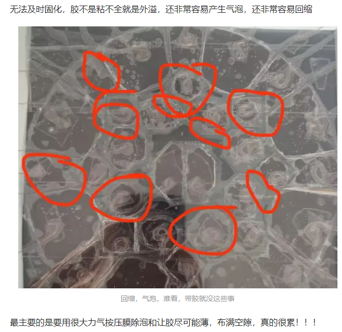
## 4\.引线

在**引线**这一步，我们需要完成的是

0. 亚克力或玻璃板
1. 一层透明胶
2. 聚酯离型膜
3. ito导电涂层
4. 漆包线
5. 单面带胶的透明胶带

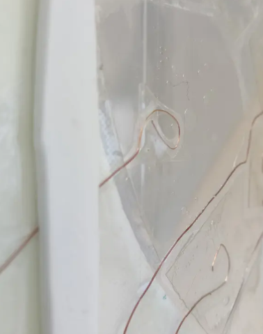

之前我说的是  
```
要去漆包线的绝缘漆，  
撕掉导电面保护膜，  
用透明胶带初固定，  
尽力沿着区间缝隙走线， 

评价是先走中心的c区，然后慢慢向外区块做，这个是中心思想，  
其次是按照从下到上 顺序操作的，先是最底下的区，56那些处理好，慢慢往上处理。  
这样在处理完一些之后，可以横着贴一张长长的透明胶带把已经完成的区固定好避免之后散掉。
```
依然可以参照，在此补充操作绝对步骤，引用我教别人的聊天记录
```
这样
先把漆包线准备好,头上刮漆打圈
把带胶不导电面贴好
然后准备一段透明胶带
然后把导电面保护膜解开
放漆包线
粘胶带
一气呵成
```
这里有关ito的一个特性，是ito遇水，二氧化碳容易变质，影响导电性能和透明性。  
所以在放上漆包线后，应当尽快用一些方法将导电面全部覆盖隔绝空气。我使用的是透明胶带，虽然不是特别好看但是能用。

关于导线具体从区块到触摸板边缘的引出方法，详见b站专栏，非常详细！


```
总的说就是先从底下的中间考虑，也就是看下图先处理底下中间红圈再处理绿圈再处理橙圈再贴一张透明胶带上去。再往上一步一步地处理整个触摸面板。

运用了贪心的思想，中间的区肯定是最需要往外走的，所以需要先考虑，从哪条缝走过去。而边上的很简单就可以引出去，可以在把难搞的安顿好之后再处理。从下往上一是因为可以做一块贴一整块透明胶带，其次是下面不会像上面一样被屏幕挡住无法从边上轻松走线。先把东西往下安顿可以减少后续上面的工作量。


要点：处理顺序、不要吝啬在圆外面的初固定胶带，周围挡起来游玩看不见，减少线乱飞
```

更新：由于根据思考，是否绕过区块都可能造成少量干扰，所以直接直线从区块上方走过去，还是从区块边缘绕过去应该效果差不多，根据试验，无论是哪种走线方式都是可行的，请按需走线

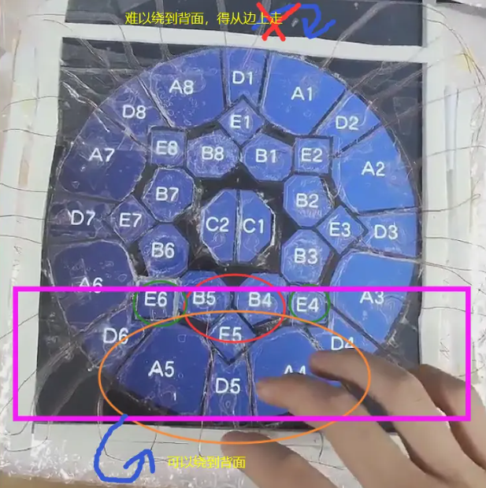

## 4\.接线
详见b站专栏，讲的足够详细，基本没有要补充的。

**发现一件逝情，我好像没说mpr跟arduino怎么连线，有人不会连，所以在此补充：**  
首先由于mpr121通过I2C总线与主控连接，所以每个mpr是并联起来的，即  
每片mpr的vcc(3.3v)接在一起，接到主控的VCC上  
每片mpr的gnd接在一起，接到主控的GND上  
每片mpr的SDA接在一起，接到主控的SDA上，如果不知道主控哪个引脚是SDA，请谷歌搜索主控板名字+pinout，或百度搜索主控板名字+引脚定义  
每片mpr的SCL接在一起，接到主控的SCL上，如果不知道主控哪个引脚是SCL，请谷歌搜索主控板名字+pinout，或百度搜索主控板名字+引脚定义    
但是在此注意，I2C总线通过地址辨识设备，mpr每片买回来的时候是同一地址，需要手动切换地址，具体方法是：  
找到您买的mpr的ADD跳线，其大概默认是短接的（默认ADD短接到GND，地址0x5A），请用小刀，螺丝刀等尖锐物将短接走线割断（刻断），请一定刻稳准狠，要确保跳线被完全刻断，并且不要伤到其他电路。然后板子应该引出了ADD的接口，ADD短接GND,VCC,SDA,SCL分别获得地址0x5A,0x5B,0x5C,0x5D。

割断/刻断过程请小心，不要伤到自己或板子其他电路  
请勿在不割断的情况下短接ADD到其他引脚特别是VCC！！！，否则造成短路！所以我们要求必须确保完全割断，不能似断非断。


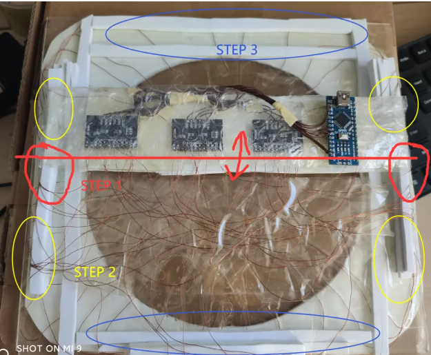
```
1.先把arduino跟mpr121的I2C连好。

2.根据程序确定哪个区接在哪个mpr121的哪个io，如果你的程序不知道是哪个io，把程序写到板子里面，用一根螺丝刀按在每个io上，看游戏测试汇报哪个区被按下。通常是连续的，比如A1到A8是一个mpr的0到7之类的，很好确定，这个是一种办法。另一种是根据你从触摸面板上接出的漆包线的位置，在程序里面规划好哪个接哪个合适不用绕，可以走线不像我一样乱糟糟。

3.走漆包线。面对从塑料板边缘引出的34根漆包线无从下手是吗？我感觉这样比较好：以横向中轴为开始的地方，从这里向上下处理。

因为两边的线很容易可以从边上引到中间的mpr121上，而偏上偏下的难搞要绕。所以从中间处理会方便很多。走线原则：从空闲地方走，尽量隔出空隙，不要横跨一张mpr121板子，上面不能直接 绕，绕最好从左右，下面也可以勉强绕一下。

之前留的漆包线建议足一些，不然这步容易踩坑：要绕一些地方焊接，就需要足够长的线。有时候线发现不够长，这时候如果你发现在透明胶带下走的路径对现在要走的地方不合适，觉得拽回来就可以了，不绕路了，够长了。但是小心！！你一拉那个漆包线，很可能把上面在触摸区域走的打好圈的线拽移位，到其他区或者圈没了。这会让你极其难办。你不得不拆下粘的很牢的透明胶带，把线重新拽回原位打圈放在该在的位置上。透明胶带这种东西撕下来粘第二次透明效果就会很差，所以千万不要乱拽漆包线，返工让你怀疑人生

但是遇到真的不够长怎么办呢，可以尝试用圆滑的焊接接上一段，做好绝缘应该没什么问题。

到这里，你的线接好了。

要点：确定好io对应区，写在之前打印过的A4纸上，对照着纸上面的区块位置接会方便很多。不要拽漆包线。
```

## 5\.程序部分

我使用的是github上的开源项目mai2Touch。曾遇到过问题如下

QA1：对于328p编译失败，不支持的开发板：改改上面的宏定义即可。（不建议使用带ch340的328p板子... ~~感觉是延迟的来源，新买的板子还没到...不确定。~~ 就是延迟的来源，不用洗，我promicro已经到了，非常低延迟，爱来自32u4。这条QA仅限于你要用UNO/NANO/MICRO才可能会用到，但是本人非常不建议使用，因为延迟极大

QA2：Serial.write 歧义 编译失败：在write传入的参数前面强制类型转换为(byte)。如Serial.write('A');改为Serial.write((byte)'A');

QA3:触摸出现问题，莫名触发，串音，灵敏度错：~~我自己重写了mpr121配置部分代码然后就解决了，某论坛有配置详细教程，这就不发了。~~实际上是从Arduino-Chunithm-Controller搬来的寄存器设定代码并加以改动，我摊牌了。

## 6\.游戏连接部分

你好，不可能发游戏的，这里只提一下连接的一些问题

QA1:怎么连的：串口直连，按照github上的readme走。

QA2:怎么按下在闪，不是长按：github（截止到写这个专栏）里面教的写错了。**DummyTouchPanel=1应该是0**，1的话是开启了的mai程序自带的调试触摸，然后导致自己的设备和自带的调试对着干，一个说按了一个说没按，就开始闪。设置为0避免程序调试触摸影响。

QA3: 怎么感觉我的触摸没问题，但是程序里面好像跟无响应一样：~~神奇问题，你插上电脑之后先用ide传一遍程序进去就会好。用rts|dts小工具试过也不行，就是ide传程序可以，非常神奇。仅发生在我手上的ch340的arduino nano上，其他板子也许没问题。传过程序之后，只要不断电，reset arduino 不会影响。断电需要重传程序解决。~~ 听国际友人说好像是ch340在arduino上锁i2c什么的？我英语很差，初中水平，看不懂.....反正避免使用328p+ch340即可解决问题。非要用的话，每次重新上电需要重刷一遍程序。

~~ 其实我当时这么乱的接线我觉得我必定失败，一定串音，结果上测试程序告诉我静默跟没接一样的一点干扰都没有\(7\-11\)，按下能上最高100多的数值\(40\-120\)，我超，太美丽了，这必成功，我都不敢相信，但是真的可以！！乱搞万岁  ~~ 删除线挂了，给其它符号转义了也没用，不知道为什么。

~~至此，已成艺术品~~  
**至此，触摸部分硬件软件完成，撒花  *★,°*:.☆(￣▽￣)/$:*.°★**

## 6\.屏幕部分  

### 触摸面板跟屏幕的摆放

对准位置，然后固定就ok了。也可做成跟我一样的可插拔式。

注意屏幕跟触摸面板之间一般需要留出3-5mm的空隙避免屏幕干扰

比如像我在边框上加了一圈单面带胶EVA垫（也可双面，直接用于固定屏幕，但是就不能做可插拔屏幕了。


### 屏幕1p设置

我的展示中的1p是因为我有俩屏幕，估计诱骗也非常的可行。  
在显示设置里面设置maimai屏幕为主屏，然后摆放在不作为maimai屏幕的那块的右边，上对齐，就可以了。  
需要启动命令全屏0，然后-popupwindow    
不知道我的方法是否适用于您的屏幕
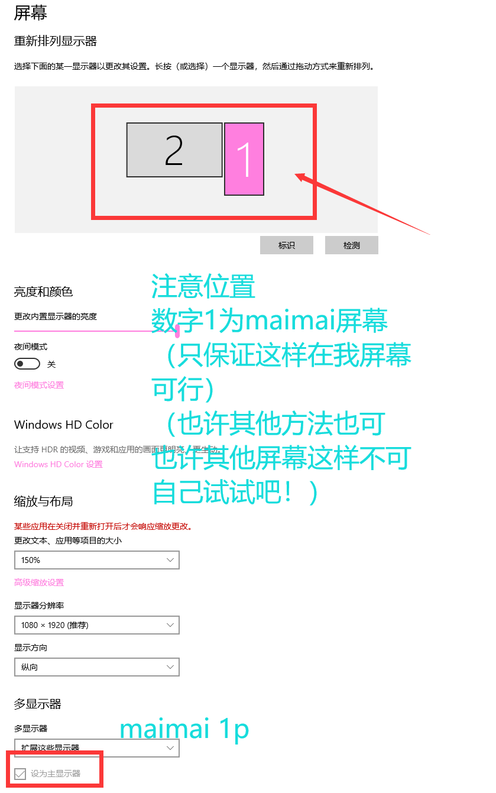


关于怎么开1p+2p，暂时没有需求，就不搞了（
应该不难

## 第四部分 读卡器个人思路分享

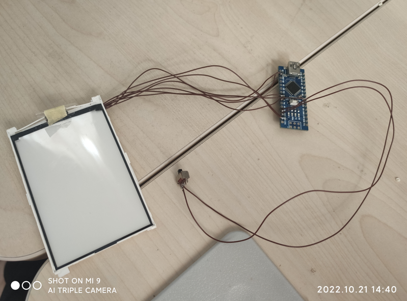
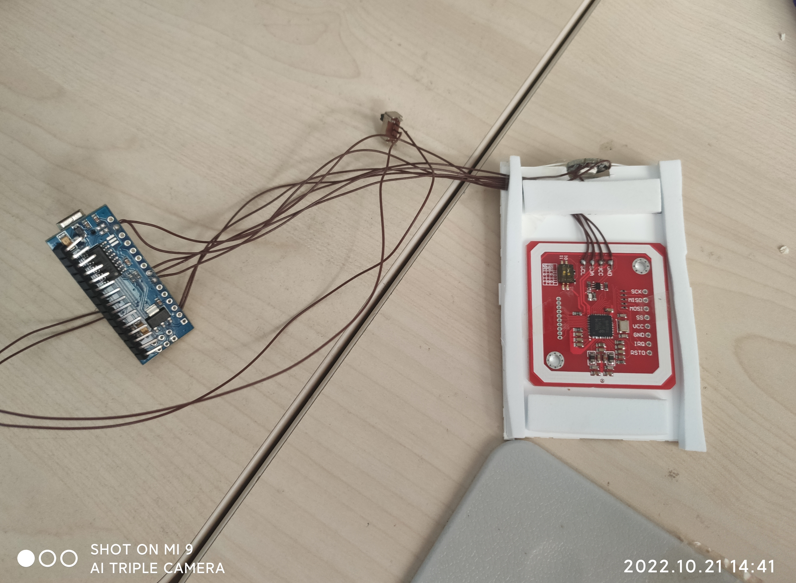

在最新一次发布的b站展示视频中，可以看见我的读卡器。他最亮眼的部分是均匀的光。其原理是使用了一块拆机的 **屏幕背光板** 进行光的一个导，视频中并非完成品，要做的更完善，需要使用大一点的背光板，配合侧照的灯，而不是我这粗制滥造的测试机的操作，不过对于全尺寸的灯加上手动侧照已经能达到如此不错的效果，等到完善之后效果应该不言而喻的非常不错。  

目前我看到其他大佬们制作的读卡器，没有使用了本方案的，我觉得这个思路对于光的均匀度方面效果不错，于是就发出来供大家参考。

关于读卡器的程序
使用的是Arduino-Aime-Reader项目。但是注意，这个项目并不原生支持328p。由于~~我家328p奇多~~读卡器并不需要极低的延迟，所以我考虑了使用~~我家奇多的~~ arduino nano(328p+ch340)制作，因为成本低。在过程中遇到了一些问题并解决了,如下：  
QA1：程序无法通过编译：需要改改宏，这个上面说过了。  
QA2：程序编译正常，readertest正常，手动发包疑似正常，就是游戏不可以：发现游戏发送初始化命令，发送dts/rts或相关内容的时候会让arduino重启（reset触发），显然不对劲，因为在重启过程中，游戏发包arduino不会给出回应。尝试短接rst与3v3强制禁止其重启，问题解决。
```
但是usb转串口可以重启arduino不是bug而是一个不错的功能，arduino在下载程序的时候需要重启才可以开始。电脑可以让arduino重启本身是为了方便下载程序而做出的美好设计，但是在此处影响了功能。  
如果直接短接会造成无法正常下载程序。我的解决方法是在rst跟3v3直接加一个开关，下载程序就断开，当读卡器的时候就闭合。  
这样也许会？对复位电路产生略微的短路，但是目前使用效果极佳，就先这样用了。
```

## 第五部分 已删除

## 第六部分 按键和灯光

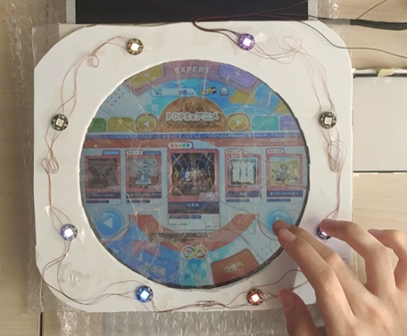

直接promicro做成键盘就完事，这个人人都会不用教网上一抓一大把。  
据说可以把灯光塞进跟按键同一个promicro，但是我没试过（
在todo列表中
待完成

由于up主不再想造街机大小的控制器，关于制作街机尺寸的按键应该是等不到了。  

小台（14寸或类似）按键制作方法，即将完成和发布（约11.5前）  
小台按键教程比触摸还难，作者认为不适合本文风格，很有可能不发了，发也是开另一个项目，感觉意义不大

<br>

------
END SEL &nbsp;&nbsp;&nbsp;&nbsp;&nbsp;&nbsp;&nbsp;&nbsp;&nbsp;&nbsp;&nbsp;&nbsp;&nbsp;&nbsp;&nbsp;&nbsp;&nbsp;&nbsp;&nbsp;&nbsp;&nbsp;&nbsp;&nbsp;&nbsp;&nbsp;&nbsp;&nbsp;&nbsp;&nbsp;&nbsp;&nbsp;&nbsp;&nbsp;&nbsp;&nbsp;&nbsp;&nbsp;&nbsp;&nbsp;&nbsp;&nbsp;&nbsp;&nbsp;&nbsp;&nbsp;&nbsp;&nbsp;&nbsp;&nbsp;&nbsp;&nbsp;&nbsp;&nbsp;&nbsp;&nbsp;&nbsp;&nbsp;&nbsp;&nbsp;&nbsp;&nbsp;&nbsp;&nbsp;&nbsp; DOCUMENT BY HELLOWORLD_DK
